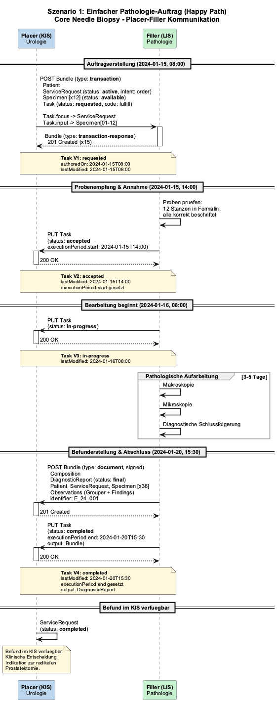
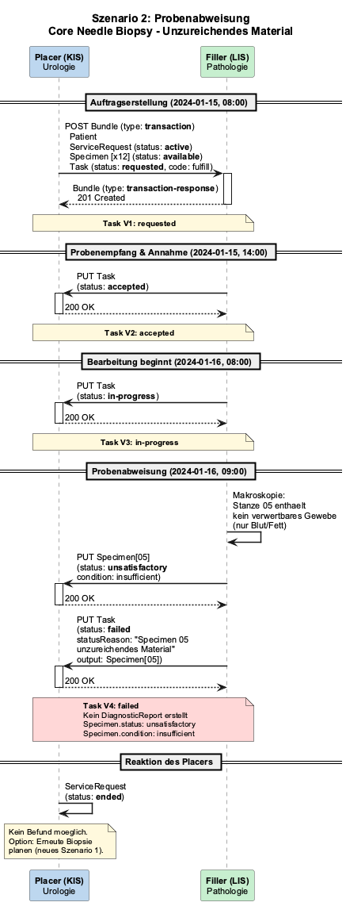
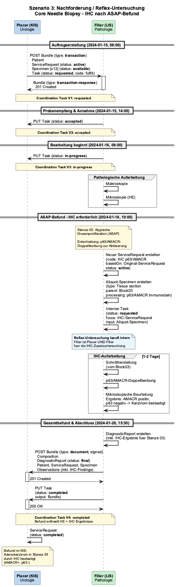
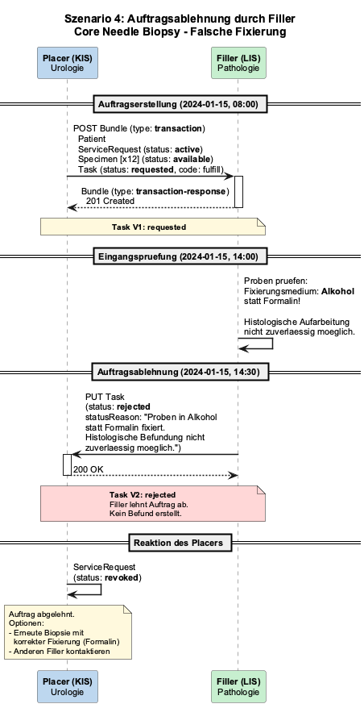
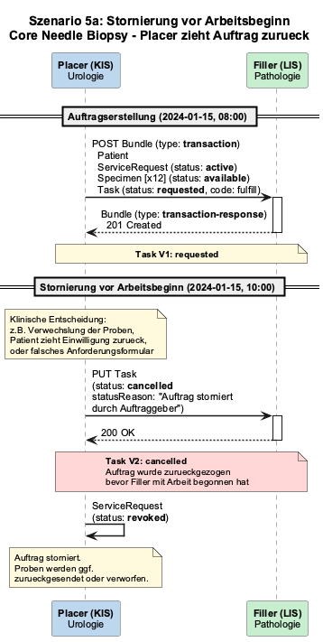
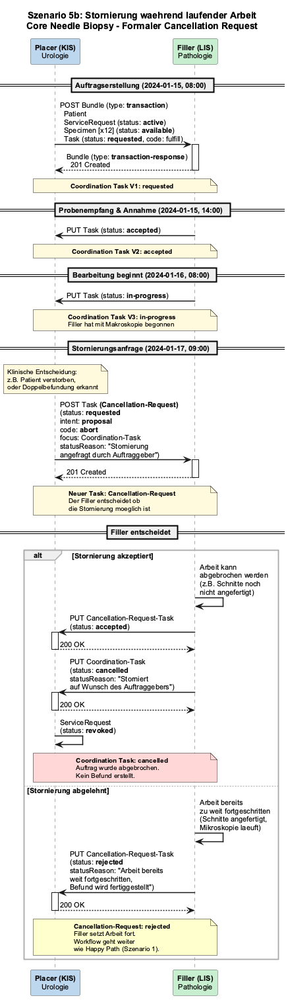
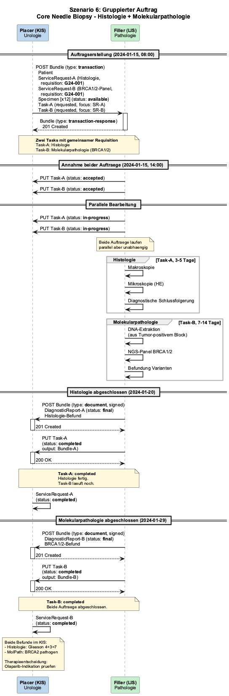
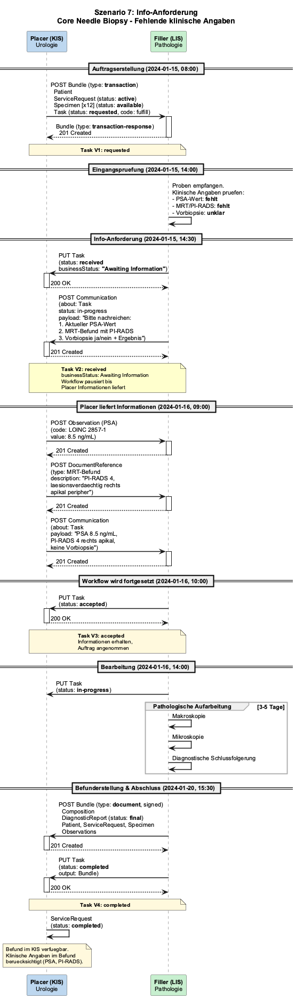

# Workflow Scenarios - Prostate Cancer Specification v0.1.0

* [**Table of Contents**](toc.md)
* **Workflow Scenarios**

## Workflow Scenarios

### Workflow Scenarios

Diese Seite beschreibt die Sendeszenarien fuer Pathologie-Auftraege basierend auf dem [Clinical Order Workflows (COW) IG](https://build.fhir.org/ig/HL7/fhir-cow-ig/en/) (v1.0.0-ballot). Der Fokus liegt auf der Kommunikation zwischen Placer (KIS/Urologie) und Filler (LIS/Pathologie) ueber Coordination Tasks.

#### Szenario 1: Einfacher Pathologie-Auftrag (Happy Path)

Der Standardfall: Kliniker sendet 12 Prostatastanzen zur histologischen Untersuchung, Pathologie erstellt Befund.

**Ablauf:**

1. Placer sendet Transaction Bundle (Patient, ServiceRequest, Specimen, Task) an Filler
1. Filler akzeptiert den Auftrag (Task: accepted)
1. Filler beginnt Bearbeitung (Task: in-progress)
1. Filler stellt Befund fertig und sendet Document Bundle zurueck (Task: completed)

**Szenario 1: Happy Path**

#### Szenario 2: Probenabweisung

Eine Stanze enthaelt kein verwertbares Prostatagewebe (nur Blut/Fett). Filler meldet Specimen als unsatisfactory.

**Ablauf:**

1. Auftrag wird normal gesendet und angenommen
1. Bei Makroskopie: Probe ist ungeeignet
1. Filler setzt Specimen.status auf "unsatisfactory" mit condition
1. Task wird auf "failed" gesetzt — kein DiagnosticReport erstellt

**Szenario 2: Probenabweisung**

#### Szenario 3: Nachforderung / Reflex-Untersuchung

Initiale HE-Mikroskopie zeigt eine atypische Drusenproliferation (ASAP) in einer Stanze. Pathologe ordnet eigenstaendig Immunhistochemie (p63/AMACR) an, um Karzinom zu bestaetigen oder auszuschliessen.

**Ablauf:**

1. Auftrag laeuft normal bis Mikroskopie
1. Filler erstellt intern neuen ServiceRequest (basedOn: Original-SR) + Aliquot-Specimen (parent: Block)
1. IHC-Aufarbeitung laeuft Filler-intern
1. Gesamtbefund (HE + IHC) wird als Document Bundle zurueckgesendet

**Szenario 3: Nachforderung (IHC nach ASAP)**

#### Szenario 4: Auftragsablehnung durch Filler

Proben sind in Alkohol statt Formalin fixiert. Pathologie kann keine zuverlaessige Histologie durchfuehren und lehnt den Auftrag ab.

**Ablauf:**

1. Auftrag wird gesendet (Task: requested)
1. Filler prueft Proben bei Eingang — falsche Fixierung erkannt
1. Filler setzt Task auf "rejected" mit statusReason
1. Placer muss ggf. erneute Biopsie mit korrekter Fixierung veranlassen

**Szenario 4: Auftragsablehnung**

#### Szenario 5a: Stornierung vor Arbeitsbeginn

Probenverwechslung erkannt. Placer storniert den Auftrag bevor der Filler mit der Bearbeitung begonnen hat.

**Ablauf:**

1. Auftrag wird gesendet (Task: requested)
1. Placer setzt Task direkt auf "cancelled" — kein formaler Cancellation-Request noetig
1. ServiceRequest wird auf "revoked" gesetzt

**Szenario 5a: Stornierung vor Arbeitsbeginn**

#### Szenario 5b: Stornierung waehrend laufender Arbeit

Patient verstirbt waehrend der Aufarbeitung. Placer fragt Stornierung an, Filler entscheidet ob Abbruch noch moeglich ist.

**Ablauf:**

1. Auftrag laeuft bereits (Task: in-progress)
1. Placer sendet einen Cancellation-Request-Task (code: abort, intent: proposal)
1. Filler entscheidet:
* **Akzeptiert:** Coordination Task wird cancelled, ServiceRequest revoked
* **Abgelehnt:** Workflow geht weiter wie Happy Path

**Szenario 5b: Stornierung waehrend laufender Arbeit**

#### Szenario 6: Gruppierter Auftrag

Urologe bestellt gleichzeitig Standard-Histologie und molekularpathologisches BRCA1/2-Panel fuer dieselbe Biopsie-Einsendung. Zwei ServiceRequests mit gemeinsamer Requisition, zwei Tasks laufen parallel.

**Ablauf:**

1. Placer sendet zwei ServiceRequests mit gleichem requisition-Identifier (G24-001)
1. Filler bearbeitet beide parallel — Histologie (3-5 Tage) und MolPath (7-14 Tage)
1. Histologie-Befund wird zuerst fertig (Task-A: completed)
1. MolPath-Befund folgt spaeter (Task-B: completed)

**Szenario 6: Gruppierter Auftrag (Histologie + MolPath)**

#### Szenario 7: Info-Anforderung

Pathologie erhaelt die Stanzen, aber klinische Angaben fehlen (PSA-Wert, MRT/PI-RADS, Vorbiopsie). Filler pausiert den Workflow und fordert Informationen an.

**Ablauf:**

1. Auftrag wird gesendet (Task: requested)
1. Filler setzt Task.businessStatus auf "Awaiting Information"
1. Filler sendet Communication mit konkreter Nachfrage
1. Placer liefert Informationen (Observation, DocumentReference, Communication)
1. Filler setzt Workflow fort (Task: accepted -> in-progress -> completed)

**Szenario 7: Info-Anforderung**

